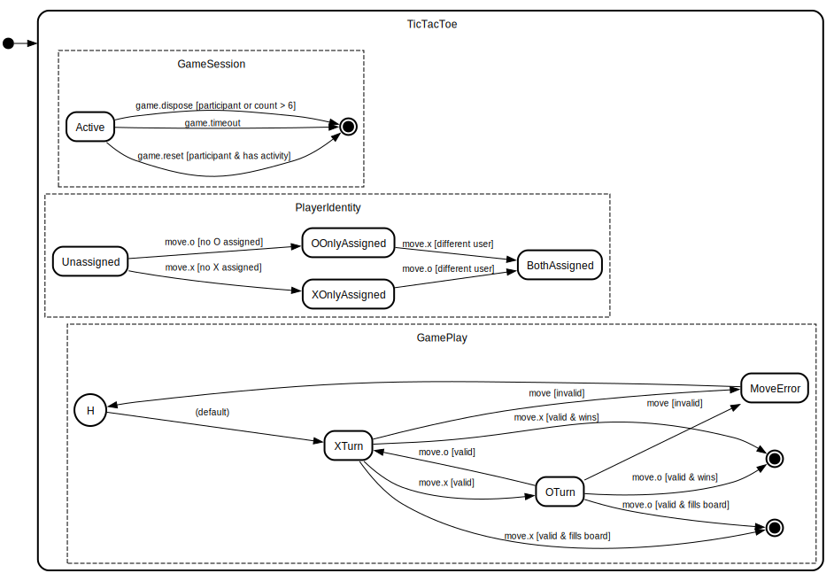
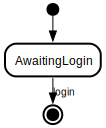
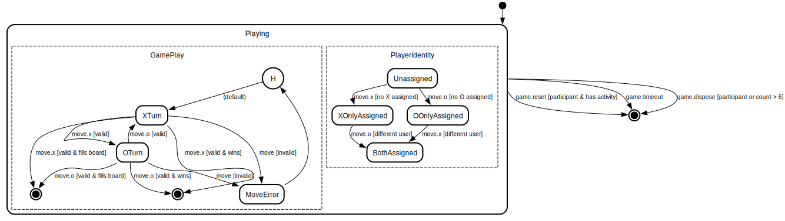

# Tic-Tac-Toe Web Application

A multi-player web-based Tic-Tac-Toe game built with F# and ASP.NET Core, featuring real-time updates and concurrent game support, inspired by [Scott Wlaschin](https://scottwlaschin.com/)'s [Enterprise Tic-Tac-Toe](https://fsharpforfunandprofit.com/ettt/).

## Features

- **Hypermedia-driven architecture** - Server-side rendering with Datastar for reactive updates, zero client JavaScript
- **Multi-player gameplay** - Two players (X and O) play from separate browsers
- **Multiple concurrent games** - Create and manage multiple games on a single page
- **Real-time updates** - Server-sent events (SSE) stream HTML patches to all connected players
- **Zero-copy streaming** - Direct rendering to Kestrel's PipeWriter for minimal allocations
- **Automatic authentication** - Cookie-based user identification with Frank.Auth declarative authorization
- **Direct game URLs** - Share game links for others to join
- **Functional-first design** - Pure game logic with MailboxProcessor for concurrent state management

## Getting Started

### Prerequisites

- .NET 10.0 SDK or later
- A modern web browser

### Running the Application

1. Clone the repository
2. Navigate to the project directory
3. Run the application:

```bash
dotnet run --project src/TicTacToe.Web/
```

4. Open your browser and navigate to `http://localhost:5228`

### Playing a Game

1. Visit the home page - you'll be automatically authenticated
2. Click **New Game** to create a game board
3. Share the game URL with another player (or open in a different browser)
4. Take turns - X plays first, then O
5. The first player to get three in a row wins!

## Statechart

The application's behavior is modeled as a sequential flow with child state machines:



1. **Authentication** ([`auth.scxml`](docs/auth.scxml)) — Cookie-based login, invoked as a child state machine

   

2. **Browsing** — User sees available game boards; multiple game instances may be active concurrently

3. **Game** ([`game.scxml`](docs/game.scxml)) — Each game is an independent child state machine with two orthogonal regions:
   - **Game Play** — Turn-by-turn progression (XTurn, OTurn, Won, Draw) with transient MoveError recovery via history
   - **Player Identity** — Role assignment tracking (Unassigned → XOnlyAssigned/OOnlyAssigned → BothAssigned)
   - Lifecycle events (dispose, reset, timeout) exit the entire game

   

The main SCXML source is at [`docs/statechart.scxml`](docs/statechart.scxml).

## Architecture

This project demonstrates modern hypermedia-driven architecture using F# and Datastar, with a focus on server-side rendering and real-time updates via SSE.

### Technologies

- **F#** - Functional-first language for concise, correct code
- **ASP.NET Core** - Web framework with Kestrel HTTP server
- **Frank 7.1.0** - Minimal routing and HTTP handling
- **Frank.Auth 7.1.0** - Declarative resource-based authentication
- **Frank.Datastar 7.1.0** - Server-sent events with streaming HTML
- **Oxpecker.ViewEngine 2.x** - Type-safe HTML rendering with zero-copy streaming
- **Playwright** - End-to-end browser automation testing

### Hypermedia Architecture

The application uses a **hypermedia-first** approach with Datastar for reactive updates:

- **Zero client JavaScript** - All UI logic lives on the server
- **SSE-driven updates** - Server broadcasts HTML patches to all connected clients
- **Declarative data binding** - Datastar attributes handle UI state
- **HTML-over-the-wire** - No JSON APIs; server sends rendered HTML fragments

### Streaming Performance

The application uses **zero-copy streaming** for both HTTP responses and SSE broadcasts:

- **HTTP responses**: `Render.toStreamAsync` writes directly to Kestrel's `PipeWriter`
- **SSE broadcasts**: `Render.toTextWriterAsync` streams HTML to the response pipe
- **No intermediate allocations**: Eliminates string materialization (18 KB per render)

**Benchmark results** (Apple M2 Pro, 100,000 concurrent renders):
- **toString + PipeWriter write (baseline)**: 578.4 ms / 2389.8 MB allocated
- **toTextWriterAsync (SSE - PipeWriter)**: 556.6 ms / 1852.3 MB (**0.96x time, 0.78x memory**)
- **toStreamAsync (HTTP - PipeWriter)**: 546.6 ms / 1849.2 MB (**0.95x time, 0.77x memory**)

The streaming approaches are **3-5% faster** and use **22-23% less memory** by eliminating intermediate string allocations. At extreme scale (1M operations), streaming saves **5.4 GB** of allocations and completes **5-6% faster**.

**These are conservative estimates.** Production SSE connections reuse one pipe across hundreds or thousands of messages, while the string-based approach allocates 18 KB per message. Real-world SSE benefits are significantly larger than these benchmark results.

See [performance-report.md](specs/001-frank-upgrade/performance-report.md) for detailed analysis.

### Key Components

- **GameSupervisor** - MailboxProcessor managing concurrent game instances with message-passing
- **PlayerAssignmentManager** - Tracks player role assignments (X/O) per game per user
- **SSE Broadcast** - Per-user HTML rendering and real-time state synchronization
- **Game Engine** - Pure functional game logic with type-safe state transitions

## Authentication

The application uses automatic cookie-based authentication:

### Flow

1. Unauthenticated users visiting the home page are redirected to `/login`
2. The login endpoint creates a persistent cookie with a unique user ID
3. Users are redirected back to their original destination
4. Subsequent requests include the cookie for identification

### Multi-Player Validation

- First player to move in a game is assigned as X
- Second player (different user) is assigned as O
- Players can only move on their turn
- Same user cannot play both sides

### Claims

- `sub` - Unique user identifier (GUID)
- `created_at` - Account creation timestamp
- `last_visit` - Last activity timestamp

## API Endpoints

All endpoints except `/login`, `/logout`, and `/sse` require authentication via Frank.Auth's declarative `requireAuth`.

| Method | Path | Description | Auth Required |
|--------|------|-------------|---------------|
| GET | `/` | Home page with all active games | ✅ |
| GET | `/login` | Authenticate and receive persistent cookie | ❌ |
| GET | `/logout` | Clear authentication cookie | ❌ |
| GET | `/sse` | SSE stream for real-time HTML patches | ❌ |
| POST | `/games` | Create a new game | ✅ |
| GET | `/games/{id}` | View a specific game | ✅ |
| POST | `/games/{id}` | Make a move (player assignment validation) | ✅ |
| POST | `/games/{id}/reset` | Reset a game (requires player assignment) | ✅ |
| DELETE | `/games/{id}` | Delete a game (requires player assignment) | ✅ |

## Testing

### Run All Tests

```bash
dotnet test
```

### Run with Server

The Playwright tests require the server to be running:

```bash
# Terminal 1: Start the server
dotnet run --project src/TicTacToe.Web/

# Terminal 2: Run tests
TEST_BASE_URL="http://localhost:5228" dotnet test
```

### Test Categories

- **HomePageTests** - Basic page loading and navigation
- **GamePlayTests** - Game mechanics, turns, win conditions (uses two browser contexts for multi-player)
- **MultiGameTests** - Concurrent game management
- **RestApiTests** - API endpoint validation

## CI/CD

GitHub Actions runs on every push and pull request:
- Build validation
- All tests (unit + Playwright)

## License

This project is licensed under the MIT License.
